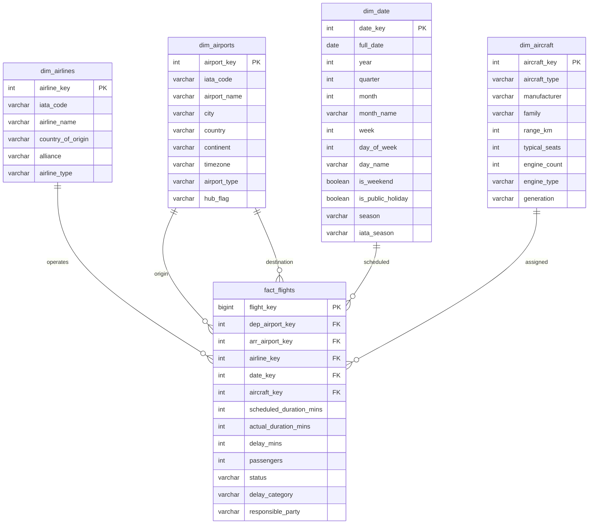

# Flight Operations Data Warehouse
**What it is**: A classic star schema warehouse built around a central flight facts table, supporting operational reporting on delays, cancellations, and on-time performance across airlines, airports, and time periods.</br>
**Real-world use**: The operational core of any airline analytics team. Every OTP report, delay attribution analysis, and schedule adherence dashboard reads from a warehouse structured exactly like this.

## Schema
```sql
fact_flights
  flight_key, dep_airport_key, arr_airport_key,
  airline_key, date_key, aircraft_key,
  scheduled_duration_mins, actual_duration_mins,
  delay_mins, passengers, status,
  delay_category, responsible_party

dim_airports
  airport_key, iata_code, airport_name,
  city, country, continent, timezone,
  airport_type, hub_flag

dim_airlines
  airline_key, iata_code, airline_name,
  country_of_origin, alliance, airline_type

dim_date
  date_key, full_date, year, quarter,
  month, month_name, week, day_of_week,
  day_name, is_weekend, is_public_holiday,
  season, iata_season

dim_aircraft
  aircraft_key, aircraft_type, manufacturer,
  family, range_km, typical_seats,
  engine_count, engine_type, generation

```

**Key reports supported**

- Monthly OTP by airline and alliance
- Delay minutes by responsible party and category
- Busiest routes by passenger volume
- Airport hub performance scorecard
- Year-over-year flight volume trends


## ER DIAGRAMS

### 1. Traditional ER Diagram (Crow's Foot Notation)

```text
┌─────────────────────────────────────────────────────────────────────────────────────┐
│                           FLIGHT OPERATIONS STAR SCHEMA                              │
└─────────────────────────────────────────────────────────────────────────────────────┘

                                    ┌──────────────────┐
                                    │    dim_date      │
                                    ├──────────────────┤
                                    │ date_key (PK)    │
                                    │ full_date        │
                                    │ year             │
                                    │ quarter          │
                                    │ month            │
                                    │ month_name       │
                                    │ week             │
                                    │ day_of_week      │
                                    │ day_name         │
                                    │ is_weekend       │
                                    │ is_public_holiday│
                                    │ season           │
                                    │ iata_season      │
                                    └────────┬─────────┘
                                             │
                                             │ 1 : M
                                             │
                    ┌────────────────────────┼────────────────────────┐
                    │                        │                        │
                    ▼                        ▼                        ▼
    ┌──────────────────────┐   ┌──────────────────────────┐   ┌──────────────────────┐
    │   dim_airports (Dep) │   │      fact_flights        │   │   dim_airports (Arr) │
    ├──────────────────────┤   ├──────────────────────────┤   ├──────────────────────┤
    │ airport_key (PK)     │   │ flight_key (PK)          │   │ airport_key (PK)     │
    │ iata_code            │   │ dep_airport_key (FK)─────┼───┼─┘                     │
    │ airport_name         │   │ arr_airport_key (FK)─────┼───┼─┐                     │
    │ city                 │   │ airline_key (FK)         │   │ iata_code            │
    │ country              │   │ date_key (FK)            │   │ airport_name         │
    │ continent            │   │ aircraft_key (FK)        │   │ city                 │
    │ timezone             │   │ scheduled_duration_mins  │   │ country              │
    │ airport_type         │   │ actual_duration_mins     │   │ continent            │
    │ hub_flag             │   │ delay_mins               │   │ timezone             │
    └──────────┬───────────┘   │ passengers               │   │ airport_type         │
               │               │ status                   │   │ hub_flag             │
               │               │ delay_category           │   └──────────────────────┘
               │               │ responsible_party        │
               │               └──────────┬───────────────┘
               │                          │
               │ 1 : M                    │ 1 : M
               │                          │
               ▼                          ▼
    ┌──────────────────────┐   ┌──────────────────────┐
    │    dim_airlines      │   │    dim_aircraft      │
    ├──────────────────────┤   ├──────────────────────┤
    │ airline_key (PK)     │   │ aircraft_key (PK)    │
    │ iata_code            │   │ aircraft_type        │
    │ airline_name         │   │ manufacturer         │
    │ country_of_origin    │   │ family               │
    │ alliance             │   │ range_km             │
    │ airline_type         │   │ typical_seats        │
    └──────────────────────┘   │ engine_count         │
                               │ engine_type          │
                               │ generation           │
                               └──────────────────────┘

Legend:
    (PK) = Primary Key
    (FK) = Foreign Key
    1 : M = One-to-Many Relationship
```

### 2. Flowchart-Style Relationship Map

```text
                    ┌─────────────────────────────────────────────────┐
                    │              FACT FLIGHTS TABLE                  │
                    │                 (Central Hub)                    │
                    └─────────────────────────────────────────────────┘
                                          │
            ┌─────────────────┬───────────┼───────────┬─────────────────┐
            │                 │           │           │                 │
            ▼                 ▼           ▼           ▼                 ▼
    ┌─────────────┐   ┌─────────────┐ ┌─────────┐ ┌─────────┐   ┌─────────────┐
    │  Airlines   │   │   Origin    │ │  Date   │ │Aircraft│   │Destination  │
    │   Dim       │   │  Airport    │ │  Dim    │ │  Dim   │   │  Airport    │
    │             │   │    Dim      │ │         │ │        │   │    Dim      │
    └─────────────┘   └─────────────┘ └─────────┘ └─────────┘   └─────────────┘
         │                   │              │          │               │
         │                   │              │          │               │
         ▼                   ▼              ▼          ▼               ▼
    [1:M]                [1:M]           [1:M]      [1:M]           [1:M]
    Each airline        Each origin      Each date  Each aircraft   Each dest
    has many flights    airport has      has many   has many        airport has
                        many flights     flights    flights         many flights
```

### 3. Detailed Relationship Matrix

```sql
-- Relationship Summary Table
┌─────────────────┬──────────────────┬─────────────────┬──────────────────────────┐
│  Parent Table   │  Foreign Key in   │  Relationship   │     Business Rule        │
│                 │   fact_flights    │    Type         │                          │
├─────────────────┼──────────────────┼─────────────────┼──────────────────────────┤
│  dim_airlines   │  airline_key      │  One-to-Many    │ One airline can operate  │
│                 │                   │                 │ multiple flights         │
├─────────────────┼──────────────────┼─────────────────┼──────────────────────────┤
│  dim_airports   │  dep_airport_key  │  One-to-Many    │ One airport can be the   │
│  (as origin)    │                   │                 │ origin for many flights  │
├─────────────────┼──────────────────┼─────────────────┼──────────────────────────┤
│  dim_airports   │  arr_airport_key  │  One-to-Many    │ One airport can be the   │
│  (as dest)      │                   │                 │ destination for many     │
│                 │                   │                 │ flights                  │
├─────────────────┼──────────────────┼─────────────────┼──────────────────────────┤
│  dim_date       │  date_key         │  One-to-Many    │ One date can have many   │
│                 │                   │                 │ flights                  │
├─────────────────┼──────────────────┼─────────────────┼──────────────────────────┤
│  dim_aircraft   │  aircraft_key     │  One-to-Many    │ One aircraft can operate │
│                 │                   │                 │ many flights over time   │
└─────────────────┴──────────────────┴─────────────────┴──────────────────────────┘
```


### 4. Mermaid.js ER Diagram (for markdown documentation)



### 5. ASCII Art Data Flow Diagram

```text
┌─────────────────────────────────────────────────────────────────────────────┐
│                         DATA FLOW DIAGRAM                                    │
└─────────────────────────────────────────────────────────────────────────────┘

    Source Systems ──────► ETL Process ──────► Data Warehouse ──────► Reports
         │                      │                     │                    │
         │                      │                     │                    │
         ▼                      ▼                     ▼                    ▼
    ┌─────────┐           ┌──────────┐          ┌──────────┐        ┌──────────┐
    │Ops DB   │           │ Extract  │          │  Star    │        │ Monthly  │
    │Flight   │──────────►│          │─────────►│  Schema  │───────►│ OTP      │
    │Data     │           │Transform │          │          │        │ Report   │
    └─────────┘           │Load (ETL)│          └──────────┘        └──────────┘
                          └──────────┘                │                    │
                                                      │                    │
                                                      ▼                    ▼
                                                ┌──────────┐        ┌──────────┐
                                                │  PowerBI │        │ Delay    │
                                                │  Dashboard│───────►│ Analysis │
                                                └──────────┘        └──────────┘
```

Let’s start what we will do:

- First, I will do my research to understand how airline companies work and what are the main business processes we are interested in analyzing.
- Then, I will gather some of the questions that we need our model to answer.
- Then we will dive into the modeling process, defining the dimensions, facts, measurements, granularity, sparsity, and summarizability issues for our model.
- Next step will be designing the schema for our model.
- Then I will collect some data to populate into the data warehouse.
- Next step, I will integrate the data into the database (SQL SERVER Database).
- Before diving into the analysis, I will spend some time talking about indexes.
- The last step is what we are doing all those steps for, which is analyzing the data warehouse and getting interesting insights to help the Management Team make data-driven decisions.

In the project files you will see some files:

- Project Documentations.pdf: The project's documentations.
- DWH Schema.png: The schema for our data warehouse model.
- DWH Tables.xlsx: The dimensions / facts / indexes of the data warehouse.
- DWH Creation.SQL: The SQL Scripts for creating the data warehouse tables.
- Schema.pdf: The schema for our data warehouse generated from SQL SERVER.
- Tables' Populations: The SQL Scripts to poulate the data into the tables.
- DWHProjAirlineCom.bak: Backup of the data warehouse, you can restore it using SQL Server Management Studio.
- Insights.SQL: The SQL Queries used to gain insights and answer questions from the data warehouse.

## Useful Resources
- [Rozek Aviation warehouse](https://github.com/rozek1997/aviation-warehouse)
- [AehabV Airline Data Warehouse](https://github.com/aehabV/AirlineDW)
- [Data With Baraa SQL Data Warehouse Project](https://github.com/DataWithBaraa/sql-data-warehouse-project)
- [Al-ghaly Airline Comapny Data Warehouse](https://github.com/al-ghaly/Airline-Company-Data-Warehouse)
- [Open Flights data Source](https://openflights.org/data)
- [Bureau of transportation statistics](https://www.transtats.bts.gov/DL_SelectFields.aspx?gnoyr_VQ=FGJ&QO_fu146_anzr=b0-gvzr)

```bash
# Save the script as init_postgresql.sql
# Then run:
psql -U postgres -f init_postgresql_database.sql

# Or with specific database user
psql -U your_username -d postgres -f init_postgresql_database.sql
```
```bash
psql -U postgres -d flight_ops_data_warehouse -f ddl_bronze.sql
```

```sql
\copy bronze.csv_fact_flights (
    dep_airport_key,
    arr_airport_key,
    airline_key,
    date_key,
    aircraft_key,
    scheduled_duration_mins,
    passengers,
    actual_duration_mins,
    delay_mins,
    status,
    delay_category,
    responsible_party
)
FROM '/home/outis/TechBoy/Flight_Operations_Data_Warehouse/datasets/facts_flights.csv'
CSV HEADER;
```
```bash
# Allow postgres user to traverse your directory
chmod o+x /home/outis
chmod o+x /home/outis/TechBoy
chmod o+x /home/outis/TechBoy/Flight_Operations_Data_Warehouse
chmod o+x /home/outis/TechBoy/Flight_Operations_Data_Warehouse/datasets

# Allow postgres to read the CSV files
chmod o+r /home/outis/TechBoy/Flight_Operations_Data_Warehouse/datasets/*.csv
```
